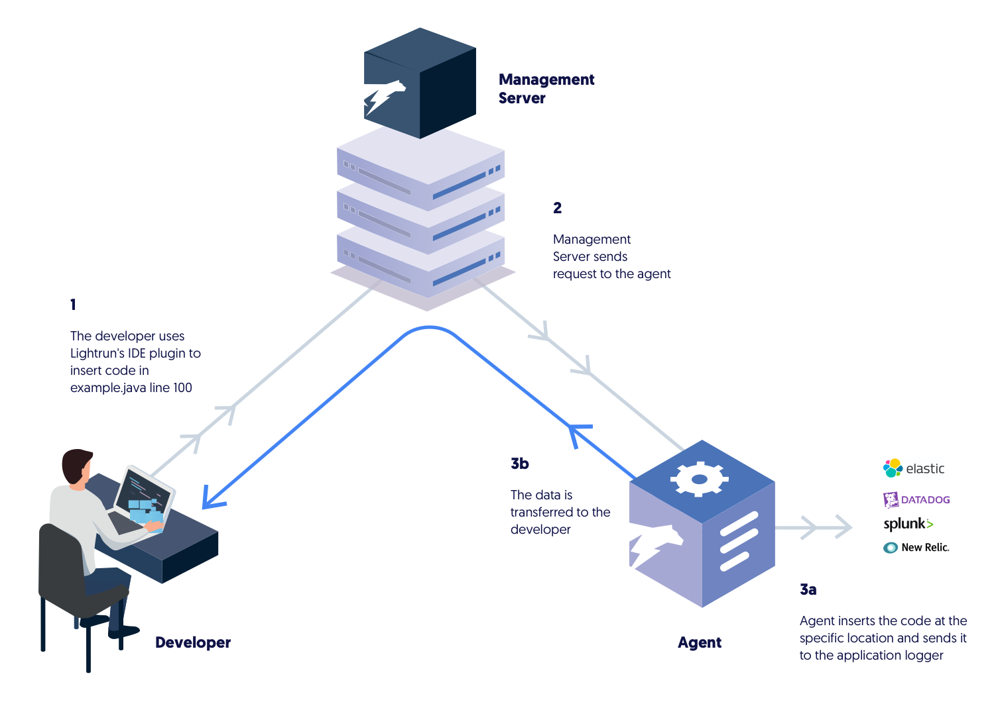

Lightrun enables you to debug your application by helping you witness real-time problems in real time, and in real environments. You can use Lightrun starting from the development environment, and also in the production environment. 

Use Lightrun to: 
- Reproduce the problem in a development or test environment
- Review the correct runtime logs 
- View and analyze actual performance metrics

Lightrun architecture
--------

Lightrun comprises these parts:

- **Backend Server** -  the Lightrun server responsible for service management; this is the fundamental "backbone" of the platform. Lightrun sets this up for you, only after which you can install and run the Lightrun agents within your running apps. 

- **Java Agent** - the JVMTI agent that runs alongside the application on your servers; this agent dynamically inserts commands in the code based on the actions you run.

- **Client** - the IDE plugin and command line utility; you can use either of them to add, remove and modify actions - whichever is part of your natural debugging workflow.

These three components communicate with one another as illustrated in the following diagram: 

To get up and running: 
- Ensure Lightrun has installed the backend server for you and get your admin account details.
- [Install](install.md) the agent on the relevant servers
- [Install the plugin](install-client.md) in your local environments